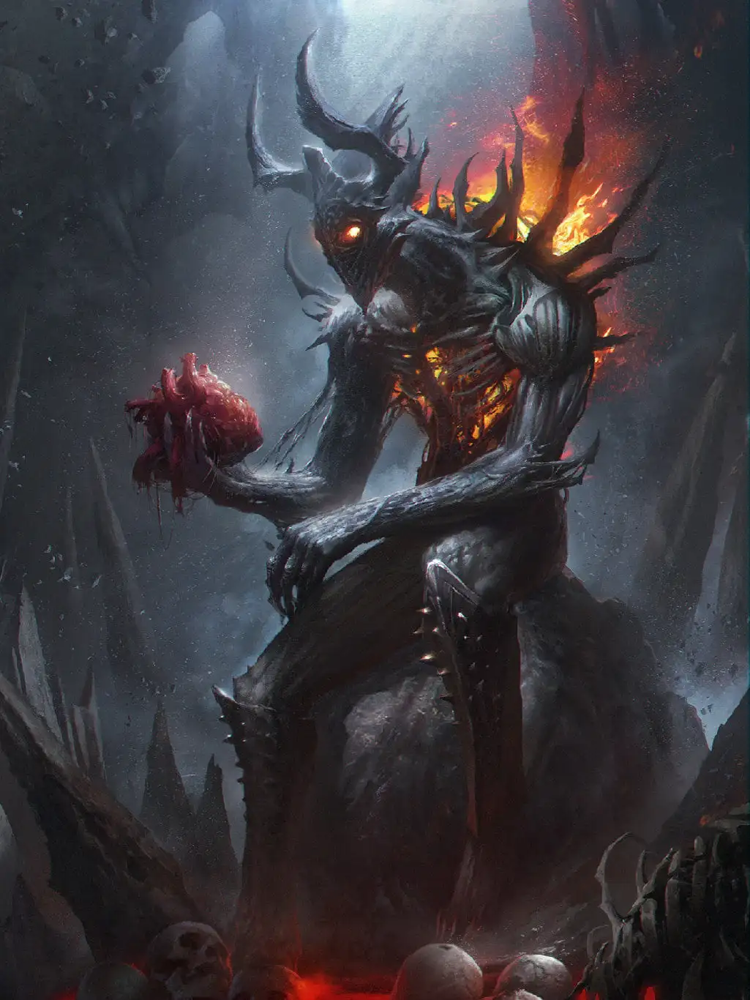

# Krozar

Krozar är en boss-fiende. Det krävs en grupp äventyrare som är väl förberedda och noga planerande för att vinna.

Krozar, en eldsdemon vars blotta existens utmanar naturens lagar. Denna skräckinjagande varelse tornar upp sig med en kropp som liknar människans form, men där all mänsklighet har ersatts av ren ondska och förtärande eld. Hans närvaro är ett löfte om förintelse, en levande påminnelse om de mörka krafter som nu regerar.

Krozars torso är ett groteskt skådespel av förstörelse och infernalisk kraft. Genom djupa revor och sprickor i bröst och mage flämtar en intensiv, pulserande brand. Denna inre eld sträcker sig mot hans rygg, där den bryter fram mellan rader av vassa, benpansar-liknande taggar som sticker ut likt en dödlig krona.

Hans huvud pryds av två massiva, vridna horn som skjuter upp mot himlen, en tydlig manifestation av hans demoniska härkomst. Men det är Krozars ögon som verkligen fångar och skrämmer betraktaren – djupa hålor fyllda med samma rasande inferno som brinner inom honom. Dessa flammande ögon tycks borra sig in i själen på alla som vågar möta hans blick.

* **Höjd:** Cirka 3 meter

---

## Attacker och förmågor

* **Antal attacker:** 2 / SR
* **Undvika attack:** 13

### Slag/spark
* **FV:** 15
* **Skada:** 3T6
* **Beskrivning:** Krozar slår eller sparkar offret med fruktansvärd kraft.

### Eldkvast
* **FV:** 14
* **Skada:** 2T6
* **CD:** 1 SR
* **Beskrivning:** Krozar öppnar munnen och sprutar ut eld mot sitt offer. Kvasten nås 10 meter och täcker 4 meter på sitt bredaste ställe.

### Inferno
* **FV:** 15
* **Skada:** 1T8+2 / SR
* **Varaktighet:** 1T4 SR
* **CD:** 3 SR
* **Beskrivning:** Krozar kallar upp helvetes eld som skapar ett inferno och täcker ett område på 20 meter radie och bränner alla offer inom radien.

### Askmolnsmantel
* **FV:** 16
* **Varaktighet:** 1T6 SR
* **Beskrivning:** Krozar sveper in sig i en magisk mantel av aska. Manteln gör det svårare att träffa Krozar med magiska attacker (alla magiska attacker och förmågor mot Krozar får -3 att lyckas). Om en magisk attack träffar Krozar sprids ett moln av aska i rummet som förvirrar motståndarna – och gör att de inte kan utföra fler attacker mot Krozar under den stridsrundan.
* *Obs:* Om Krozar aktiverar askmolnsmanteln igen när den redan är aktiv nollställs varaktigheten.

---

## Kroppsform och kroppspoäng

* **Typ:** Fysisk, demon, vidunder
* **Total kroppspoäng:** 500

| Resultat | Träffpunkt | RV | KP |
| :--- | :--- | :---: | :---: |
| 1–2 | Huvud | 6 | 125 |
| 3–4 | Höger arm | 6 | 125 |
| 5–6 | Vänster arm | 6 | 125 |
| 7–11 | Bröst | 6 | 250 |
| 12–14 | Mage | 6 | 166 |
| 15–17 | Höger ben | 6 | 166 |
| 18–20 | Vänster ben | 6 | 166 |

---

## Motstånd och svagheter

| Typ av attack | Effekt |
| :--- | :---: |
| Fysisk | 50% |
| Magisk | 50% |
| Magisk – Is | 200% |
| Helig | 200% |

---

## Plats

Krozar befinner sig i [Smidesstaden, i Blodssmedjan i rummet Demonernas förvar](https://docs.google.com/document/u/0/d/1Xf2jUJt142sZa1BrMLwuOKSmWN1METsTJct6DYD2m0s/edit).
