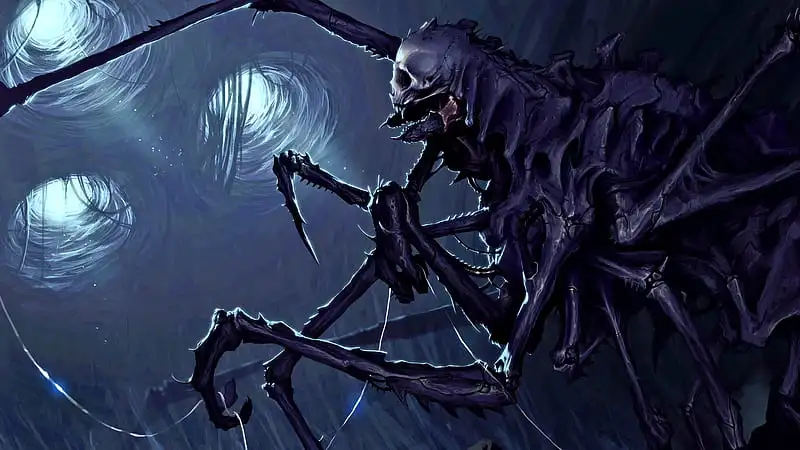

# Marvdrottning

Marvdrottningen är en boss-fiende. Det krävs en grupp äventyrare som är väl förberedda och noga planerande för att vinna.

Marvdrottningen är en skräckinjagande varelse som kombinerar drag från både spindlar och människor på ett groteskt sätt. Hennes massiva kropp påminner om en gigantisk spindel, med långa, ledade ben som avslutas i vassa klor. Dessa ben ger henne både snabbhet och en skrämmande räckvidd.

Det mest kusliga med marvdrottningen är hennes huvud – en enorm dödskalle som sitter på en spindelliknande kropp. Denna makabra kombination förstärker hennes onaturliga och skräckinjagande natur.

Likt en spindel spinner marvdrottningen nät, men dessa är grövre och starkare än vanliga spindelnät. Hon använder näten både för att fånga byten och för att skapa ett hem åt sig själv och sin koloni av marvar.

En av marvdrottningens viktigaste funktioner är att lägga ägg som kläcks till nya marvar. Detta gör henne till centrum för hela marvsamhället och förklarar varför marvarna är så dedikerade till att skydda och mata henne.

Marvdrottningen är en skrämmande hybrid mellan spindel och människa, en monstruös varelse som styr över en armé av marvar genom en slags kollektiv medvetenhet.

---

## Attacker och förmågor

* **Antal attacker:** 3 / SR
* **Undvika attack:** 10

### Riva
* **FV:** 15
* **Skada:** 2T6+2
* **Beskrivning:** Marvdrottningen sträcker ut sina långa lemmar och river sitt offer med klorna.

### Spinna nät
* **FV:** 14
* **Beskrivning:** Marvdrottningen skjuter ett nät mot sitt offer, som trasslas in i det klibbiga nätet. Offret får -2 i alla handlingar. Om offret träffas av ytterligare nät får de ytterligare -2 i alla fysiska handlingar. Effekten varar tills offret lyckas tvätta av sig ordentligt. Attacken kan undvikas.

### Skräckinjagande (passiv)
* **Beskrivning:** Alla i marvdrottningens närvaro fruktar för sina liv. Varje stridsrunda måste offren slå ett **PSY**-slag. Om de misslyckas får de -1 i alla handlingar.

### Silkespansar
* **FV:** 15
* **Varaktighet:** 6 stridsrundor
* **Användning:** Kan användas en gång per strid.
* **Beskrivning:** Marvdrottningen spinner snabbt ett lager av superstark silke runt sig själv, vilket ger henne +5 i försvar under 6 stridsrundor.

### Kalla på marvar
* **Användning:** Kan användas en gång per strid.
* **Beskrivning:** Marvdrottningen utstöter ett högt, skärande ljud som kallar tre [marvar](https://docs.google.com/document/u/0/d/148xnC449jPc5uosrG0VGZscni8fEZ8-A8_jIGvIQXdc/edit) till platsen.

### Psykisk överbelastning
* **FV:** 16
* **Skada:** 1T6+2 (magisk skada)
* **Begränsning:** Kan endast användas en gång per SR. Attacken träffar alltid i huvudet.
* **Beskrivning:** Marvdrottningen överbelastar sin psykiska länk till en fiende, vilket orsakar intensiv mental smärta. Offret måste klara ett **PSY-5** slag för att undvika attacken. Om offret misslyckas tar offret magisk skada och blir desorienterad (-3 på alla handlingar) i denna och nästa SR.

---

## Kroppsform och kroppspoäng

* **Typ:** Fysisk, skräckvarelse, vidunder
* **Total kroppspoäng:** 400

| Resultat | Träffpunkt | RV | KP |
| :--- | :--- | :---: | :---: |
| 1 | Huvud | 4 | 100 |
| 2–3 | Höger arm | 6 | 100 |
| 4–5 | Vänster arm | 6 | 100 |
| 6–9 | Bröst | 6 | 200 |
| 10–13 | Mage | 6 | 100 |
| 14–20 | Ben | 12 | 200 |

---

## Motstånd och svagheter

| Typ av attack | Effekt |
| :--- | :---: |
| Fysisk | 100% |
| Magisk | 100% |
| Helig | 150% |

---

## Plats

Marvdrottningen befinner sig i sin lya, ingången till lyan finns vid [Den gamla ekens dunge i stadsträdgården, Allmogens kvarter](https://docs.google.com/document/u/0/d/1BxGX_JJhRWzDjztxAPex72S6OCv3rPD6T-ip7pPoZ5s/edit).
