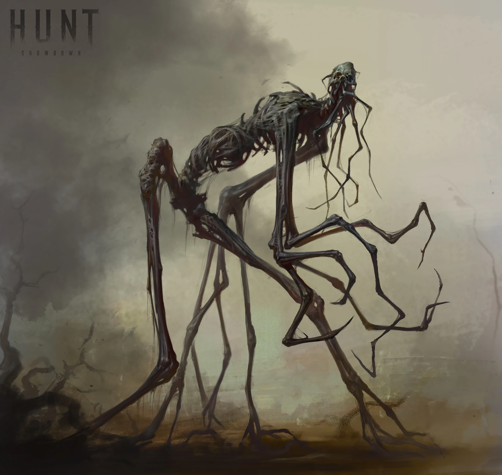

# Nyctalid

Nyctalid är en boss-fiende. Det krävs en grupp äventyrare som är väl förberedda och noga planerande för att vinna.

I Dysterhamns eviga skymning reser sig Nyctalid, en skräckinjagande varelse som tycks vara en grotesk fusion av skelett och jätteinsekt. Denna 5 meter höga best dominerar omgivningen med sin blotta närvaro.

Nyctalids kropp är en mager, humanoid silhuett av svart kitin och blottade ben. Dess torso är täckt av ett exoskelett som pulserar svagt i mörkret, genombrutet av spetsiga utskott. Det humanoida huvudet pryds av ett par enorma, fasetterade ögon som glöder med en kuslig, gul-grön lyster.

Från axlarna utgår två långa och spindellika armar, med fingrar som förgrenar sig likt rötter eller spindelben. Benen är långa och ledade som på en bönsyrsa, vilket ger Nyctalid en onaturlig och skrämmande gångstil.

Över hela kroppen löper ett nätverk av svarta ådror som pulserar med en onaturlig, mörk energi. När Nyctalid rör sig hörs ett kusligt rasslande från dess benstruktur, blandat med det skärande ljudet av kitin mot kitin.

I mörkret utsöndrar Nyctalid en svag, fosforescerande dimma som tycks dansa runt dess kropp, vilket förstärker dess spöklika uppenbarelse och gör det svårt att urskilja var varelsen slutar och mörkret börjar.

## Attacker och förmågor

* **Antal attacker:** 2/SR
* **Undvika attack:** 12

### Kiselklor
* **FV:** 14
* **Skada:** 3T4+1

Nyctalid sträcker ut en lång arm och skär offret med sina vassa klor.

### Nattsvärm
* **FV:** 15
* **Skada:** 1T6 (skadan delas bara en gång, när förmågan aktiveras)
* **Varaktighet:** 1T4 SR (slå för varje offer)
* **CD:** 3 SR

Nyctalid skickar ut ett magiskt mörker som tar formen av hundratals fladdermöss. Fladdermössen anfaller alla offer inom 20 meters radie och skadar och stör deras syn. Offret får **-3** i allt de gör mot Nyctalid medan fladdermössen är aktiva (stackar ej).

### Psykisk terror
* **FV:** 14
* **Skada:** 1T8+2

Nyctalid utför en psykisk attack som skadar och försvagar offret. Offret måste klara ett **PSY-3** slag för att undvika att försvagas. Om offret försvagas gör hen **-3 skada** med alla fysiska attacker.

### Greppa
* **FV:** 16
* **Skada:** 1T8+2

Nyctalid greppar tag om sitt offer i en slumpvis vald kroppsdel och håller fast i 3 SR. Varje SR tar offret skada. Offret kan försöka bryta sig fri, men måste klara ett **STY-15** slag. Offret kan inte göra något förutom att försöka bryta sig fri under tiden hen är fasthållen.

> **Obs:** Offret kommer loss om Nyctalid dör, eller om Nyctalid erhåller minst 30 skada i armen som greppar offret.

### Skuggdimma (Passiv)
Dimman som utsöndras från Nyctalidens kropp spelar spratt med offrens sinnen. Alla spelare som vill utföra en siktad attack mot Nyctalid måste först klara av ett **PER-slag**. Om slaget misslyckas träffar attacken i en slumpvis vald kroppsdel istället.

*Spelare med magisk syn aktiv luras ej av dimman, och behöver således inte slå PER-slaget.*

## Kroppsform och kroppspoäng

* **Typ:** Fysisk, skräckvarelse, vidunder
* **Total kroppspoäng:** 350

| Resultat | Träffpunkt | RV | KP |
| :--- | :--- | :---: | :---: |
| 1–2 | Huvud | - | 87 |
| 3–4 | Höger arm | - | 87 |
| 5–6 | Vänster arm | - | 87 |
| 7–11 | Bröst | - | 175 |
| 12–14 | Mage | - | 116 |
| 15–17 | Höger ben | - | 116 |
| 18–20 | Vänster ben | - | 116 |

## Motstånd och svagheter

| Typ av attack | Effekt |
| :--- | :--- |
| **Fysisk** | 100% |
| **Magisk** | 100% |
| **Helig** | 150% |

## Plats

Nyctalid befinner sig i [Skuggkvarteren, i Skuggornas gränd](https://docs.google.com/document/u/0/d/1G8mkO7yUQkA5ae6-VLOdeto1e8WmES8aLy5fi1WFVSE/edit).
