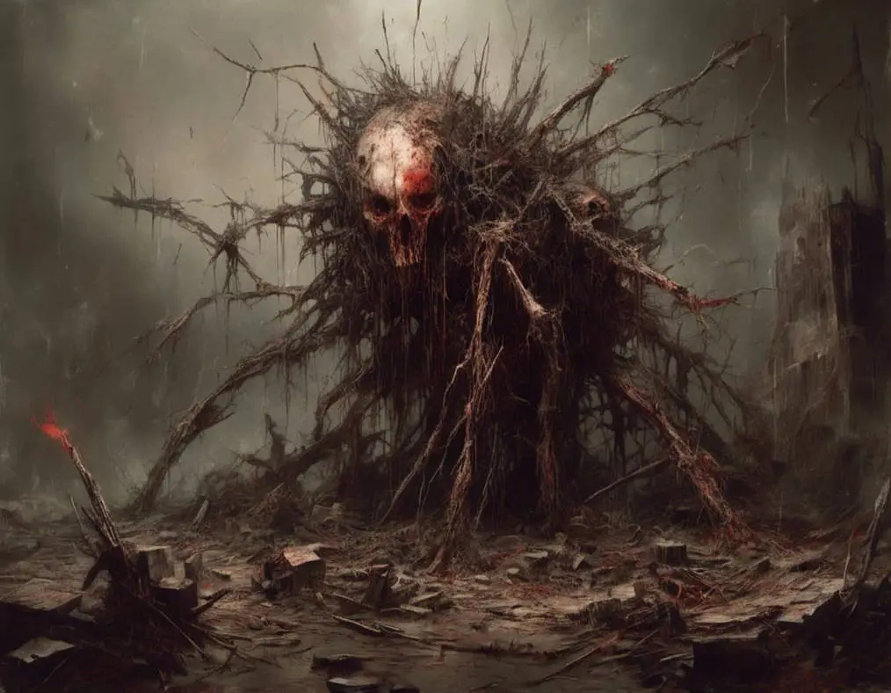

# Rotmarok

Rotmarok är en boss-fiende. Det krävs en grupp äventyrare som är väl förberedda och noga planerande för att vinna.

Rotmarok är en enorm och skrämmande varelse vars kropp är en skrämmande kombination av rötter, ben och mörk energi. Med en imponerande höjd på cirka fem meter och en struktur som liknar en levande, förvriden trädstam, är Rotmarok en levande manifestation av ondskan som förgiftar Dysterhamns jord. Dess huvud är en grotesk döskalle, omgiven av en ständig dimma av mörk magi och en illaluktande aura som sprider skräck och förtvivlan.

Rotmaroks rötter är kraftfulla och vrider sig som ormar genom marken, vilket ger den kontroll över omgivningen och förmågan att åkalla mörka krafter.

---

## Attacker och förmågor

* **Antal attacker:** 2 / SR
* **Undvika attack:** 8

### Rotslag
* **FV:** 15
* **Skada:** 2T6+2
* **Beskrivning:** Rotmaroken skickar iväg en rot-tentakel för att slå sitt offer.

### Rotfångst
* **FV:** 15
* **Varaktighet:** 1T4+2 SR
* **CD:** 3 SR
* **Beskrivning:** Rotmaroken skickar ut sina rötter längs med marken och fångar alla spelare inom 30 meters radie. Spelarna måste lyckas med ett **SMI-3** slag för att undvika att bli fångade (spelare med färdigheten *akrobatik* behöver bara lyckas med ett **SMI**-slag).
* **Effekt:** Om en spelare blir fångad kan hen inte undvika attacker eller röra sig (däremot kan hen fortfarande attackera, kasta besvärjelser, parera, blockera, etc.).

### Spetsa
* **FV:** 14
* **Skada:** 3T4
* **CD:** 1 SR
* **Beskrivning:** Rotmaroken formar en tentakel till ett vasst spjut och spetsar sitt offer. Attacken ignorerar fysisk RV.

### Taggregn
* **FV:** 16
* **Skada:** 3 per tagg
* **CD:** 2 SR
* **Beskrivning:** Rotmaroken skjuter iväg taggar åt alla håll så de regnar ner över slagfältet. Alla spelare inom 30 meters radie blir träffade (om de inte lyckas undvika attacken).
  * Slå **1T6** för att avgöra hur många taggar som träffar offret.
  * Slå sedan **1T20** för varje tagg för att avgöra träffpunkt.
  * Attacken ignorerar fysisk RV.

### Mörkervigg
* **FV:** 14
* **Skada:** 1T8+2 (magisk skada av typen mörker)
* **Beskrivning:** Rotmaroken skickar en blixt av mörk energi mot sitt offer. Attacken kan ej siktas och kan ej undvikas (den kan dock blockeras med magi).

---

## Kroppsform och kroppspoäng

* **Typ:** Fysisk, skräckvarelse, vidunder
* **Total kroppspoäng:** 375

| Resultat | Träffpunkt | RV | KP |
| :--- | :--- | :---: | :---: |
| 1 | Huvud | – | 93 |
| 2–7 | Kropp | 4 | 187 |
| 8–20 | Tentakler | – | 20 |

> **Obs:** Rotmarok kan bara bli skadad i huvudet eller kroppen. Om en tentakel blir skadad/förstörd växer en ny ut i dess ställe.

---

## Motstånd och svagheter

| Typ av attack | Effekt |
| :--- | :---: |
| Fysisk | 100% |
| Magisk | 100% |
| Helig | 150% |

---

## Plats

Rotmarok befinner sig i [Köpmansplatsen, i Handelsborgen](https://docs.google.com/document/u/0/d/1-AdM6PLDQ_F7BLGvkcwZhH4nO1AzDTA-lNek_VyyiiQ/edit).
