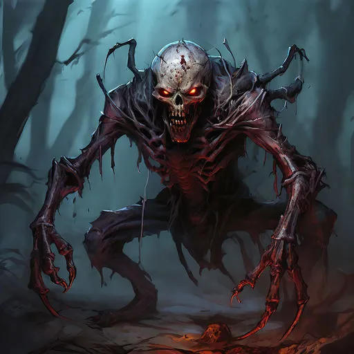

# Drävul

Drävul är en skrämmande varelse som rör sig med en grym elegans. Dess kropp är en grotesk blandning av människolikt och insektslikt, vilket ger den en både spöklik och främmande känsla. De tre långa klorna på varje hand är ett av dess mest skrämmande kännetecken, perfekta för både klättring och strid.

{.konfidentiellt}

## Attacker och förmågor

* **Antal attacker:** 1 / SR
* **Undvika attack:** 13

### Klösa
* **FV:** 13
* **Skada:** 1T8+1
* **Beskrivning:** Drävul klöser offret med sina långa klor.

### Spotta syra
* **FV:** 14
* **Skada:** 1T8 / SR
* **Varaktighet:** 1T4 SR
* **CD:** 2 SR
* **Beskrivning:** Drävul spottar syra mot sitt offer. Om offret blir träffad av den frätande syran tar hen skada varje stridsrunda.

## Kroppsform och kroppspoäng

* **Typ:** Fysisk, skräckvarelse, odöd
* **Total kroppspoäng:** 50

| Resultat | Träffpunkt | RV | KP |
| :--- | :--- | :---: | :---: |
| 1–2 | Huvud | – | 12 |
| 3–4 | Höger arm | – | 12 |
| 5–6 | Vänster arm | – | 12 |
| 7–11 | Bröst | – | 25 |
| 12–14 | Mage | – | 16 |
| 15–17 | Höger ben | – | 16 |
| 18–20 | Vänster ben | – | 16 |

## Motstånd och svagheter

| Typ av attack | Effekt |
| :--- | :---: |
| Fysisk | 100% |
| Magisk | 100% |
| Helig | 200% |

{/}
