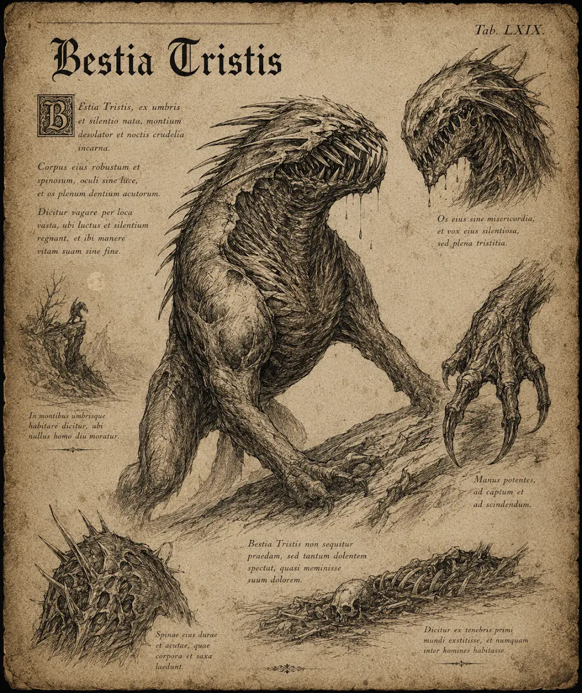

# Dysterbest

{.spelledare}Dysterbesten är en mellanstark fiende. Ensam utgör den inget större hot mot en grupp äventyrare, men en mot en kan den bli väldigt farlig.{/}

Dysterbesten är en hundliknande varelse som jagar i flock. Besten livnär sig på blod och kan lukta sig till blod på hundra meters avstånd. När en flock har fått upp vittring på ett villebråd hörs deras morr och skall lång väg. \
Dysterbestens kropp är täckt av taggar som skyddar den mot attacker, och som används som vapen när besten springer på sitt offer.

{.konfidentiellt}

Dysterbestar används ibland av vampyrer som vakthundar i deras herrgårdar och slott.

# Attacker och förmågor

Antal attacker: 1/SR \
Undvika attack: 12

## Tackla

FV: 14 \
Dysterbesten tar sats och springer rakt på sin motståndare. Motståndaren måste klara ett SMI-5 slag för att inte ramla omkull. Om offret ramlar omkull missar hen sin nästa stridsrunda för att ta sig upp. \
Skada: 1T10

Dysterbesten kan bara använda förmågan om den har ett avstånd på minst fem meter från offret.

## Bett

FV: 14 \
Dysterbesten biter sitt offer med sina långa, vassa tänder och sliter upp stora sår för att kunna dricka dess blod. Dysterbestens saliv är fullt med bakterier vilket kan orsaka sjukdomar och blodförgiftning hos offret. \
Skada: 1T12+2

Om attacken lyckas skapas ett blödande sår som måste bandageras/healas för att det ska sluta blöda. Såret gör 4 skada varje stridsrunda. Det kan uppstå flera blödande sår i samma kroppsdel (då stackar effekten).

Om attacken lyckas, slå 1T20:

| Resultat | Effekt |
| --- | --- |
| 1-12 | Inget händer |
| 13-16 | Förgiftad, 1T6 skada / SR |
| 17-19 | Blodförgiftning* |
| 20 | Stelkramp** |

*Blodförgiftning kan orsaka frossa, feber, smärta, andnöd, förvirring, diarré, kräkningar, ledvärk och muskelsvaghet. Blodförgiftning kan vara livshotande om det inte behandlas snabbt. Symptomen dyker upp inom några timmar.

**Stelkramp kan orsaka ljud- och ljuskänslighet, andnöd och kramper. Stelkramp är livshotande.

# Kroppsform och kroppspoäng

**Typ:** Fysisk, skräckvarelse

**Total kroppspoäng:** 60

| Resultat | Träffpunkt | RV | KP |
| --- | --- | --- | --- |
| 1-2 | Huvud | 2 | 15 |
| 3-4 | Höger framben | 2 | 20 |
| 5-6 | Vänster framben | 2 | 20 |
| 7-11 | Övre rygg / Bröst | 2 | 30 |
| 12-14 | Nedre rygg / Mage | 2 | 30 |
| 15-17 | Höger bakben | 2 | 20 |
| 18-20 | Vänster bakben | 2 | 20 |

# Motstånd och svagheter

| Typ av attack | Effekt |
| --- | --- |
| Fysisk | 100% |
| Magisk | 100% |
| Helig | 200% |

{/}
