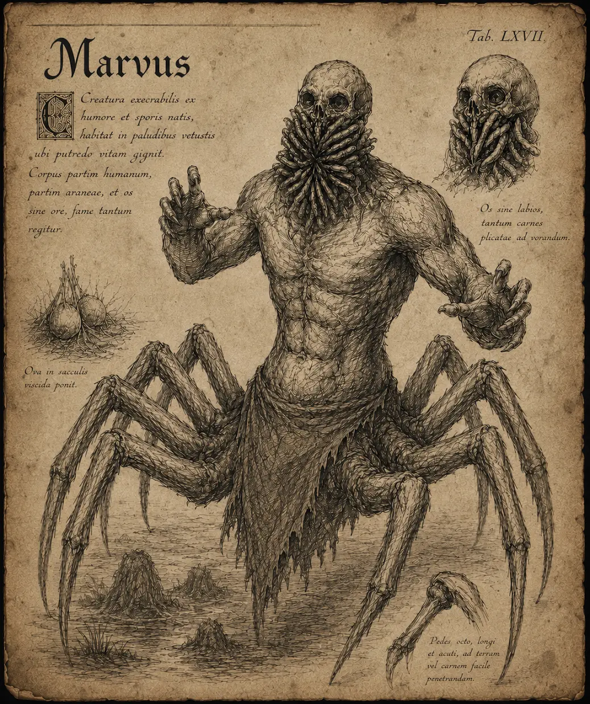

# Marv

{.spelledare}Marven är en mellanstark fiende. Ensam utgör den inget större hot mot en grupp äventyrare, men en mot en kan den bli väldigt farlig.{/}

Marvens underkropp påminner om en spindels, med många ben, medan överkroppen liknar en människas, med torso, två armar och ett huvud. Marven är en del av en hivemind som styrs av marvdrottningen. Marvens uppgift är att skydda drottningen och hämta mat åt henne.

# Attacker och förmågor

Antal attacker: 1/SR \
Undvika attack: 12, 10

## Psykisk attack

FV: 14 \
Marven sätter fingrarna mot tinningarna och skickar ut vågor av ond, psykisk energi mot offret. Attacken ignorerar fysisk RV. \
Skada: 1T10+2 \
CD: 2 SR

## Bläckgas

FV: 18 \
Marven öppnar munnen och spyr ut sig en svart, oljig gas som påminner om bläck. Gasen sprider sig åt alla håll och lägger sig som en rökridå i ett stort område (ca 5x5m). Gasen underlättar för marven att undvika attacker eller rentav fly striden. \
CD: 5 SR

{.spelledare}Gasen är brandfarlig, men kan bara antändas av magisk eld. Om den antänds orsakas en explosion som gör 2T10 skada i området.{/}

## Sparkar

FV: 15 \
Marven har många, starka ben som den kan sparka med, alla benen sparkar ut i tur och ordning och träffar alla fiender runt om marven. \
Skada: 1T8+4

# Kroppsform och kroppspoäng

**Typ:** Fysisk, skräckvarelse

**Total kroppspoäng:** 60

| Resultat | Träffpunkt | RV | KP |
| --- | --- | --- | --- |
| 1 | Huvud | - | 15 |
| 2-3 | Höger arm | - | 20 |
| 4-5 | Vänster arm | - | 20 |
| 6-10 | Bröst | - | 30 |
| 10-13 | Mage | - | 30 |
| 14-20 | Ben | 6 | 20 |

# Motstånd och svagheter

| Typ av attack | Effekt |
| --- | --- |
| Fysisk | 100% |
| Magisk | 100% |
| Helig | 150% |
