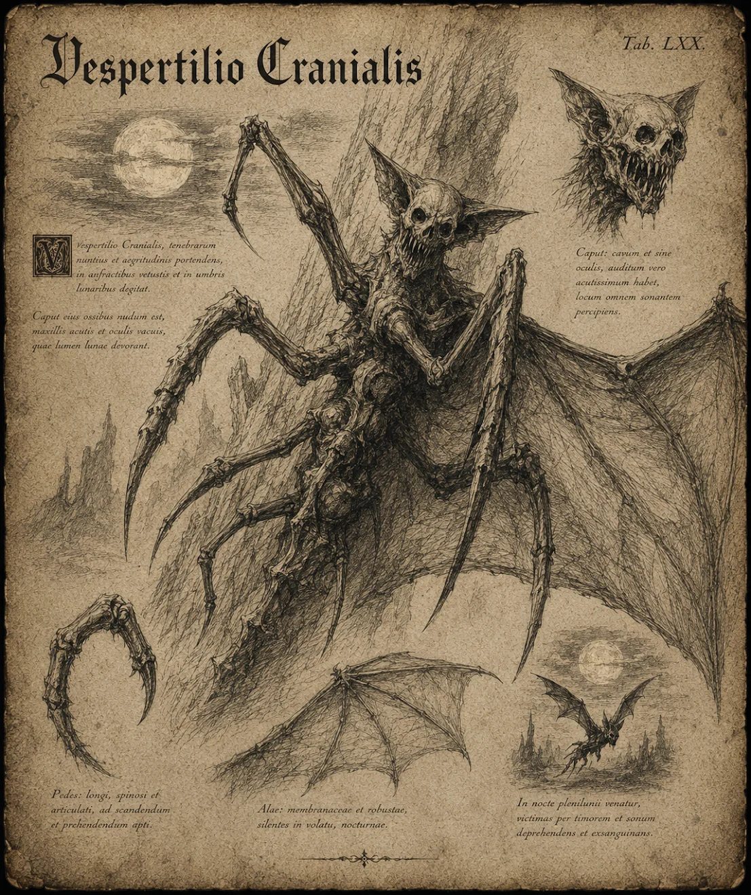

# Skräckmal

{.spelledare}Skräckmalen är en mellanstark fiende, ensam utgör den inget större hot mot en grupp äventyrare, men 1v1 skulle den kunna vinna. Skräckmalar jagar i grupp.{/}

Skräckmalen har en lång, smal kropp med åtta ben. Kroppen och benen är täckta av hårt skal som skyddar den mot skada. På ryggen sticker två enorma vingar ut; som liknar vingarna på fladdermöss. Huvudet liknar en döskalle, med tomma ögonhålor. Trots avsaknaden av ögon har den god syn och perfekt nattsyn.

# Attacker och förmågor

Antal attacker: 2/SR \
Undvika attack: 16

## Hugg

FV: 15 \
Skräckmalen hugger sitt byte med sina starka ben. \
Skada: 1T12

## Skri

FV: 16 \
Skräckmalen ger ifrån sig ett högt skri som skär i öronen. Skriet manar fram visioner om hur offret dör. Alla som hör skriet påverkas. Offret måste klara ett PSY-3 slag. \
CD: 3 SR

Om attacken lyckas, slå 1T20:

| Resultat | Effekt |
| --- | --- |
| 1-6 | Inget händer |
| 7-10 | -1 i allt, 5 SR |
| 11-13 | -2 i allt, 5 SR |
| 14-16 | -4 i allt, 5 SR. Offret kan inte längre aktivera magiska förmågor eller kasta besvärjelser. |
| 17-19 | -5 i allt, 10 SR. Offret kan inte längre aktivera magiska förmågor eller kasta besvärjelser. Offret kan inte heller attackera. Offret vill bara fly. |
| 20 | -10 i allt, 10 SR. Offret kan inte längre aktivera magiska förmågor eller kasta besvärjelser. Offret kan inte heller attackera. Offret klarar inte längre av att fly, utan blir liggande i fosterställning. |

Om offret blir träffad av ännu ett skri, medan effekterna av ett tidigare skri är aktivt så “uppgraderas” effekten en nivå, och varaktigheten nollställs.

# Kroppsform och kroppspoäng

**Typ:** Fysisk, skräckvarelse

**Total kroppspoäng:** 55

| Resultat | Träffpunkt | RV | KP |
| --- | --- | --- | --- |
| 1 | Huvud | - | 13 |
| 2-9 | Vingar | - | 18 |
| 10-15 | Kropp | 6 | 30 |
| 16-20 | Ben | 6 | 20 |

# Motstånd och svagheter

| Typ av attack | Effekt |
| --- | --- |
| Fysisk | 100% |
| Magisk | 150% |
| Helig | 150% |
