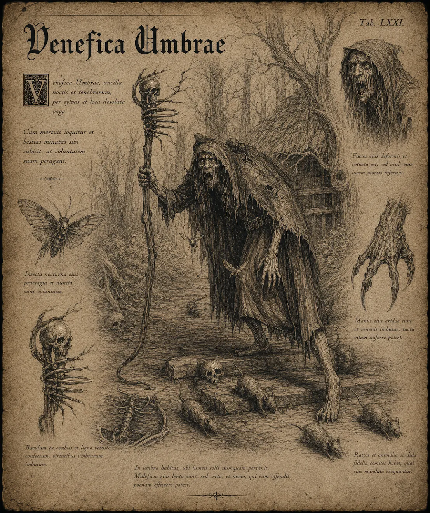

# Skugghäxa

{.spelledare}Skugghäxan är en mellanstark fiende. Ensam utgör den inget större hot mot en grupp äventyrare, men en mot en kan den bli väldigt farlig.{/}

**Beskrivning:** Humanoida varelser med långa, beniga armar och kloliknande händer. Deras ansikten är dolda bakom trasiga huvor, och de kan framkalla skuggor för att förvirra och skrämma sina fiender.

**Beteende:** Skugghäxor är intelligenta och använder magiska krafter för att kontrollera skuggor och framkalla illusioner. De kan också kasta förbannelser som försvagar deras fiender.

# Attacker och förmågor

Antal attacker: 1/SR \
Undvika attack: 10

## Förbannelse: Svaghet

FV: 14 \
Skugghäxan förbannar offret som blir svag. Offret får -5 STY medan förbannelsen är aktiv. Offret får även -3 på alla STY-baserade slag och delar -5 skada (ex vid en vanlig attack). \
Varaktighet: 1T4+3 SR.* \
CD: 2 SR

## Förbannelse: Rädsla

FV: 14 \
Skugghäxan förbannar offret med rädsla. Offret får -5 PSY medan förbannelsen är aktiv. Offret måste även klara ett PSY-slag varje gång hen ska göra något mot häxan. Om slaget misslyckas blir offret paralyserat av skräck och missar sin stridsrunda. \
Varaktighet: 1T4+3 SR.* \
CD: 2 SR

*Flera förbannelser kan vara aktiva på samma offer samtidigt. I så fall stackar effekterna. Om effekterna av förbannelserna skulle sänka en grundegenskap under 0, så dör offret omedelbart.

## Mana fram Dysterlingar

FV: 14 \
Skugghäxan manar fram 1T4 dysterlingar som hjälper henne i striden. Dysterlingarna finns kvar hela striden, eller tills de besegras. \
CD: 3 SR

## Andemagisk attack

FV: 14 \
Skugghäxan skjuter en grön boll av andemagi mot offret (kan ej siktas). Magin ignorerar fysisk RV. \
Skada: 2T8

# Kroppsform och kroppspoäng

**Typ:** Fysisk, skräckvarelse

**Total kroppspoäng:** 50

| Resultat | Träffpunkt | RV | KP |
| --- | --- | --- | --- |
| 1-2 | Huvud | - | 12 |
| 3-4 | Höger arm | - | 12 |
| 5-6 | Vänster arm | - | 12 |
| 7-11 | Bröst | - | 25 |
| 12-14 | Mage | - | 16 |
| 15-17 | Höger ben | - | 16 |
| 18-20 | Vänster ben | - | 16 |

# Motstånd och svagheter

| Typ av attack | Effekt |
| --- | --- |
| Fysisk | 150% |
| Magisk | 100% |
| Helig | 150% |
