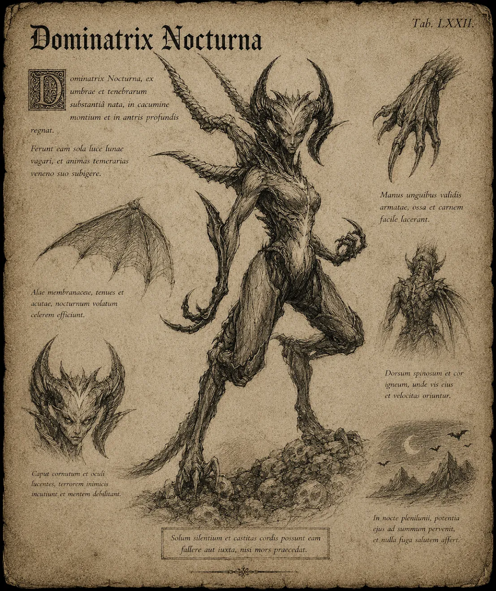

# Succubus

Succubus är en demonisk varelse som förför sina offer med förtrollande skönhet och manipulativ charm. Hon är en mästare på att locka sina offer in i dödliga fällor, och livnär sig på deras livskraft. Trots sitt förföriska yttre är hon hänsynslös och farlig, med krafter som kan tömma sina fienders styrka och vilja.

{.konfidentiellt}

# Attacker och förmågor

Antal attacker: 1/SR \
Undvika attack: 14

## Piska

FV: 13 \
Succubus snärtar sitt offer med sin piska. \
Skada: 1T12

## Eldklot

FV: 14 \
Succubus kastar ett eldklot mot sitt offer. \
Skada: 2T6 (magisk eld)

## Viljeutplåning

FV: 13 \
Succubus försvagar offrets vilja och motståndskraft, vilket gör att offret tar 150% fysisk och magisk skada. \
Varaktighet: 1T6 SR \
CD: 2 SR

# Kroppsform och kroppspoäng

**Typ:** Fysisk, demon

**Total kroppspoäng:** 55

| Resultat | Träffpunkt | RV | KP |
| --- | --- | --- | --- |
| 1-2 | Huvud | - | 13 |
| 3-4 | Höger arm | - | 13 |
| 5-6 | Vänster arm | - | 13 |
| 7-11 | Bröst | - | 27 |
| 12-14 | Mage | - | 18 |
| 15-17 | Höger ben | - | 18 |
| 18-20 | Vänster ben | - | 18 |

# Motstånd och svagheter

| Typ av attack | Effekt |
| --- | --- |
| Fysisk | 100% |
| Magisk | 50% |
| Helig | 150% |

{/}
