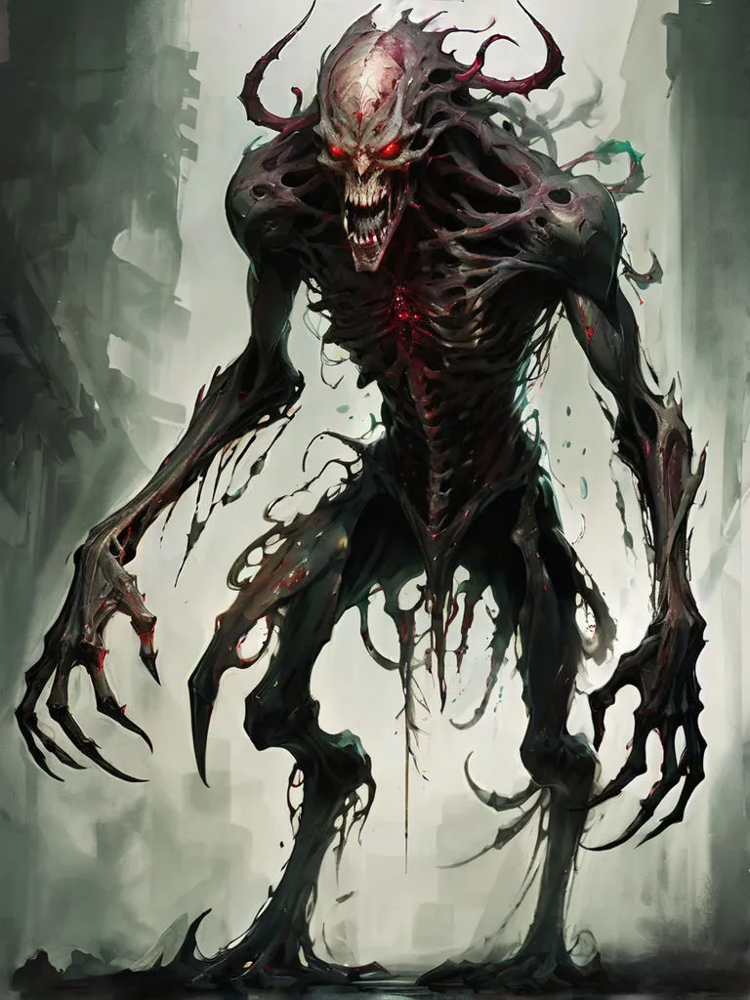

# Ryvok

{.spelledare}Ryvoker är starka fiender som jagar på egen hand och slår till från skuggorna. En grupp äventyrare borde vara jämnstarka med en reva.{/}

**Ryvok** är en skräckinjagande varelse som förtär ångest och smärta. Den angriper sina byten genom att dra ut deras mest plågsamma minnen och föda på den förtvivlan som följer. Ryvok är mästare på att manipulera mörkret och kan smälta samman med skuggorna för att förbli osynlig tills den slår till. Dess magi består av skräckfyllda mardrömmar som kan förlama även de modigaste krigarna.

Ryvok jagar helst i skuggorna och utnyttjar sin förmåga att kontrollera andra skräckväsen som vakthundar, vilka den styr genom mental dominans.

{.spelledare}
## Attacker och förmågor

* **Antal attacker:** 3/SR
* **Undvika attack:** 16

### Riva
* **FV:** 16
* **Beskrivning:** Ryvok river sitt offer med sina vassa klor.
* **Skada:** 1T6+8

### Skuggsvepning
* **FV:** 14
* **Beskrivning:** Ryvok sveper in sig i skuggor och blir osynlig för blotta ögat. När Ryvoken är osynlig kan den endast ses med hjälp av magisk mörkersyn.

### Rygghugg
* **FV:** 16
* **Beskrivning:** Om ryvok är osynlig kan den utföra ett rygghugg mot ett ovetande offer. Attacken träffar alltid om den lyckas.
* **Skada:** (1T6+8) * 2

### Mardrömsvisioner
* **FV:** 14
* **Beskrivning:** Ryvok skapar skräckinjagande syner av offrets värsta mardrömmar, förlamar dem med rädsla och tär på deras mentala motståndskraft tills de bryts ner.
* **Effekt:** Offret får -3 PSY.
* **Varaktighet:** Tills striden är över, eller tills ryvok/offret dör.
* **Särskild regel:** Om offret sjunker under 1 i PSY dör hen omedelbart.

## Kroppsform och kroppspoäng

* **Typ:** Fysisk, skräckvarelse
* **Total kroppspoäng:** 120

| Resultat | Träffpunkt | RV | KP |
| :--- | :--- | :--- | :--- |
| 1-2 | Huvud | 6 | 30 |
| 3-4 | Höger arm | 6 | 30 |
| 5-6 | Vänster arm | 6 | 30 |
| 7-11 | Bröst | 6 | 60 |
| 12-14 | Mage | 6 | 40 |
| 15-17 | Höger ben | 6 | 40 |
| 18-20 | Vänster ben | 6 | 40 |

## Motstånd och svagheter

| Typ av attack | Effekt |
| :--- | :--- |
| Fysisk | 50% |
| Magisk | 100% |
| Helig | 200% |
{/}
