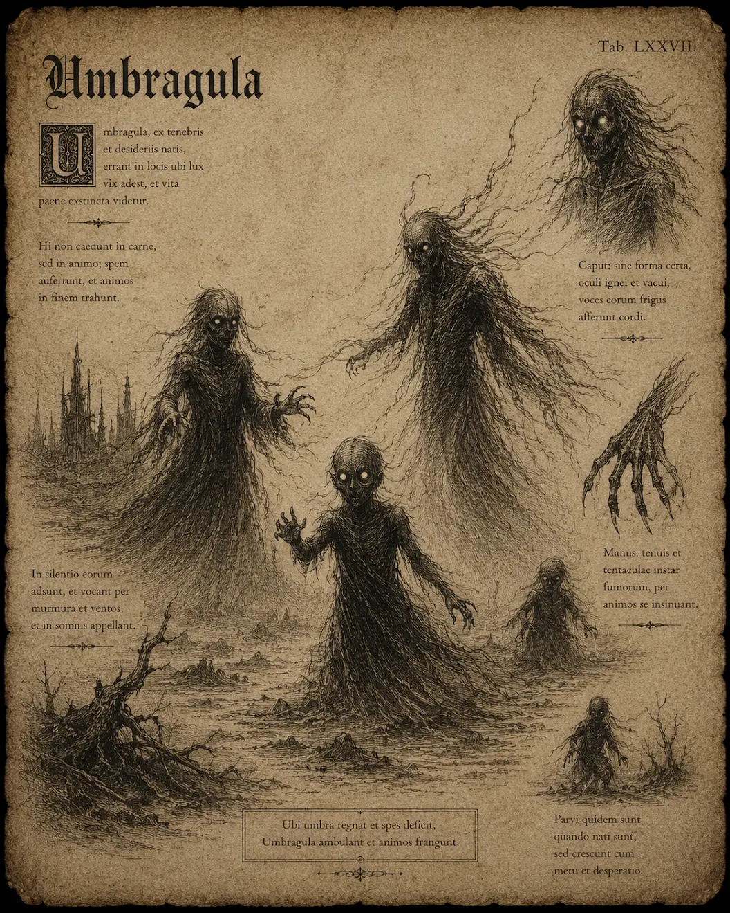

# Dysterling

{.spelledare}Dysterlingar är svaga fiender som anfaller i grupp. En ensam äventyrare bör kunna hantera ett par stycken på egen hand utan problem.{/}

Små, humanoida varelser med genomskinlig, mörk hud och lysande ögon. De rör sig snabbt och ljudlöst genom skuggorna. Dysterlingar var en gång barn som blivit mördade och tvingats uppstå som skuggvarelser.

{.spelledare}Dysterlingar är icke-fysiska, så det kan endast ta skada av magiska attacker. Dysterlingar som svärmar är livsfarliga. Magiska AOE-attacker och helig magi är effektiva.{/}

# Attacker och förmågor

Antal attacker: 1/SR \
Undvika attack: 10

## Psykisk attack

FV: 12 \
Dysterlingen sträcker ut en hand och skickar ett klot av ond, psykisk energi mot offret. Attacken ignorerar fysisk RV. \
Skada: 1T6+2 \
CD: 2 SR

## Riva

FV: 10 \
Dysterlingen river offret med sin klo (fysisk skada). \
Skada: 1T6

## Svärma

Dysterlingar i grupp kan svärma och övermanna ett offer om de är fler än offrets STY/4. Offret paralyseras och kan inte utföra några handlingar. Varje SR blir offret riven av samtliga dysterlingar.

# Kroppsform och kroppspoäng

**Typ:** Icke-fysisk, skuggvarelse, skräckvarelse

**Total kroppspoäng:** 25

| Resultat | Träffpunkt | RV | KP |
| --- | --- | --- | --- |
| 1-2 | Huvud | - | 6 |
| 3-4 | Höger arm | - | 6 |
| 5-6 | Vänster arm | - | 6 |
| 7-11 | Bröst | - | 12 |
| 12-14 | Mage | - | 8 |
| 15-17 | Höger ben | - | 8 |
| 18-20 | Vänster ben | - | 8 |

# Motstånd och svagheter

| Typ av attack | Effekt |
| --- | --- |
| Fysisk | 0% |
| Magisk | 150% |
| Helig | 200% |
