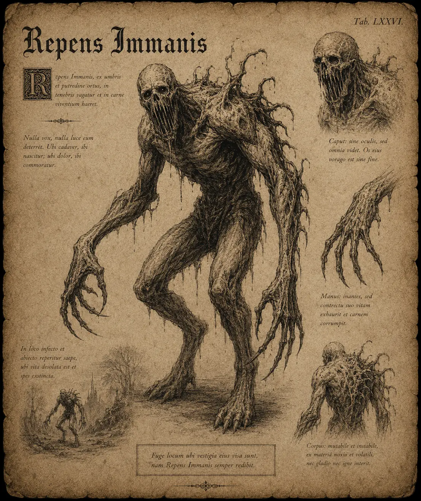

# Hasare

{.spelledare}Hasare är svaga fiender som raglar omkring ensamma. Dock kan de locka dit andra, starkare fiender om spelarna är oförsiktiga. En ensam äventyrare bör kunna hantera ett par stycken på egen hand utan problem.{/}

Hasare är varelser av mänsklig storlek, med långa armar avslutade med vassa klor. Deras ben är svaga och förtvinade, vilket tvingar dem att hasa sig långsamt fram. Munnen är fylld med stora, sylvassa tänder, redo att slita sina byten itu.

{.konfidentiellt}

# Attacker och förmågor

Antal attacker: 1/SR \
Undvika attack: 8

## Bita

FV: 13 \
Hasaren biter offret med sina sylvassa tänder. \
Skada: 1T8+2

## Hugga tag

FV: 10 \
Monstret sträcker ut sina långa, starka armar och hugger ner sina vassa klor i offret. Om attacken lyckas kan hasaren slå för förmågan “Hålla fast”. \
Skada: 1T10

## Hålla fast

FV: 12 \
Hasaren håller fast offret. Varje SR biter hasaren offret. Offret kan bryta sig loss genom att klara ett STY-3 slag.

## Vråla

Varje runda som hasaren ser en fiende finns det en chans att den vrålar. Ett vrål kan locka dit andra monster, ofta den fruktade revan som använder hasare som lockbete.

| Stridsrunda | Chans |
| --- | --- |
| 1 | 5 |
| 2 | 7 |
| 3-5 | 9 |
| 6+ | 10 (+1 för varje SR som går) |

Chans att slumpmässigt monster dyker upp: 1-12 \
Chans att en reva dyker upp: 13-20

# Kroppsform och kroppspoäng

**Typ:** Fysisk, skräckvarelse

**Total kroppspoäng:** 35

| Resultat | Träffpunkt | RV | KP |
| --- | --- | --- | --- |
| 1-2 | Huvud | 2 | 8 |
| 3-4 | Höger arm | 2 | 8 |
| 5-6 | Vänster arm | 2 | 8 |
| 7-11 | Bröst | 2 | 16 |
| 12-14 | Mage | 2 | 11 |
| 15-17 | Höger ben | - | 11 |
| 18-20 | Vänster ben | - | 11 |

# Motstånd och svagheter

| Typ av attack | Effekt |
| --- | --- |
| Fysisk | 100% |
| Magisk | 150% |
| Helig | 150% |

{/}
