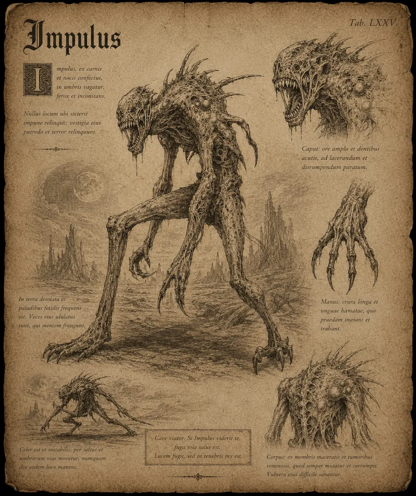

# Imp

{.spelledare}Imper är svaga fiender som anfaller i grupp. En ensam äventyrare bör kunna hantera ett par stycken på egen hand utan problem.{/}

Imper är små, fega demoner som kan anta olika utseenden. Somliga har vingar, en del går upprätt på benen, vissa kryper fram på alla fyra, samtliga är ondskefulla och njuter av att se död och lidande. Vissa imper kan hantera vapen och verktyg, och några kan kasta besvärjelser. De har ofta orange-röd hud, skarpa klor och vassa tänder. \
Imper klarar inte av att uträtta mycket på egen hand, men om en mäktigare demon tar kommando över dem kan de användas till många olika saker. Exempelvis som kanonmat, som armé, som scout-trupper eller som mat åt starkare monster. På så vis är de väldigt lika svartblodens vättar.

Imper används ibland av mäktiga magiker som krigare, då de enkelt kan manas fram ur helvetet. (Starkare demoner är mer motståndskraftiga mot frammaningar och kan välja själva.)

{.konfidentiellt}

# Attacker och förmågor

Antal attacker: 1/SR \
Undvika attack: 12

## Attack (med klo eller vapen)

FV: 12 \
Impen gör ett utfall med sina klor eller eventuella vapen. \
Skada: 1T6+2 (eller vapnets skada)

## Besvärjelse: eldboll

FV: 13 \
Impen kastar ett klot av eld mot offret (kan ej siktas). Skadan är magisk. Det finns en risk att offret fattar eld och brinner. \
Skada: 2T6

Risk att fatta eld: slå 1T10, om resultatet är 9-10 så fattar offret eld. \
Offret brinner i 1T4 SR. \
Skada: 1T6+2 \
Offret kan fatta eld i flera kroppsdelar samtidigt. (Om samma kroppsdel fattar eld fler gånger så skrivs de tidigare över av de senare.)

# Kroppsform och kroppspoäng

**Typ:** Fysisk, demon

**Total kroppspoäng:** 30

| Resultat | Träffpunkt | RV | KP |
| --- | --- | --- | --- |
| 1-2 | Huvud | - | 7 |
| 3-4 | Höger arm | - | 7 |
| 5-6 | Vänster arm | - | 7 |
| 7-11 | Bröst | - | 15 |
| 12-14 | Mage | - | 10 |
| 15-17 | Höger ben | - | 10 |
| 18-20 | Vänster ben | - | 10 |

# Motstånd och svagheter

| Typ av attack | Effekt |
| --- | --- |
| Fysisk | 100% |
| Is / Vatten | 150% |
| Helig | 150% |
| Eld | 50% |

{/}
