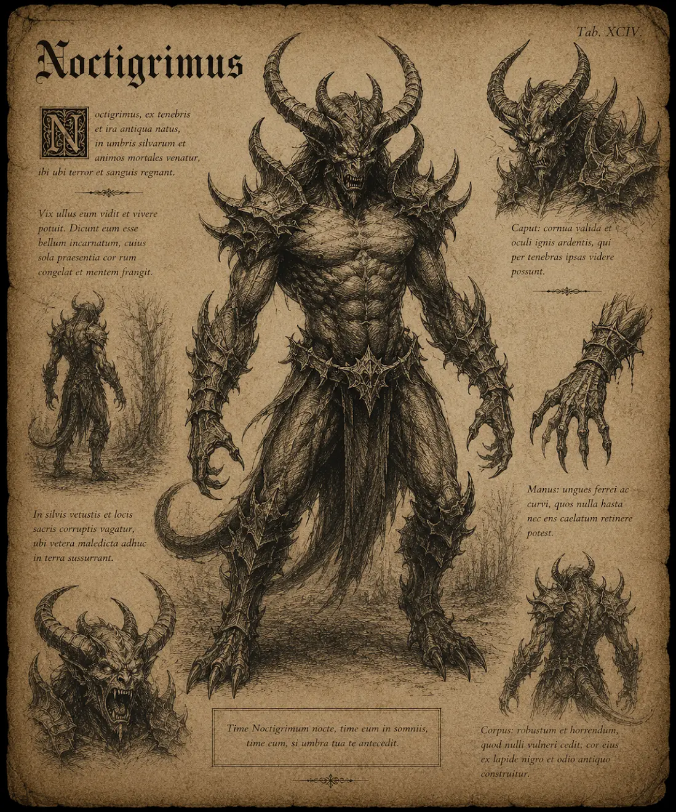

# Nattgrim

{.spelledare}Nattgrim är starka fiender som söker villebråd på egen hand. En grupp äventyrare borde vara jämnstarka med en nattgrim.{/}

Nattgrimen är en mäktig demon med kolsvart hud och ett skräckinjagande, schimpansliknande ansikte prytt med två massiva horn som reser sig från pannan. Dess ögon glöder svagt i mörkret, och dess muskulösa, humanoida kropp utstrålar rå styrka. Nattgrimen rör sig smidigt genom skuggorna, och dess närvaro sprider en isande kyla som förvrider både verkligheten och sinnena hos dem som vågar närma sig. Det sägs att Nattgrimen är en härskare över nattens mörkaste krafter, och dess vrede kan förgöra hela städer.

# Attacker och förmågor

Antal attacker: 3/SR \
Undvika attack: 16

## Styrkeslag

FV: 14 \
Nattgrimens mäktiga slag skickar chockvågor som skakar alla i närheten. \
Skada: 1T12+6

## Stånga

FV: 14 \
Nattgrimen stångar sitt offer med sina mäktiga horn och genomborrar dem. \
Skada: 2T8+2

## Demonisk Blick

FV: 15 \
Nattgrimen låser sina glödande ögon på ett mål, vilket orsakar en våg av terror som kan lamslå fienden eller till och med få dem att vända sig mot sina allierade. Offret måste klara ett PSY-3 slag för att inte bli lamslagen. Om offret fumlar kommer hen attackera sin närmaste allierade under 1T4 SR. \
CD: 2 SR

## Svart Eld

FV: 14 \
Nattgrimen antänder sitt offer med en svart eld. Offret måste klara ett FYS-5 slag för att inte fatta eld. Om offret fattar eld brinner hen i 1T6 SR och tar 1T6 skada varje SR. \
Skada: 3T6 (magisk eld) \
CD: 2SR

## Mörkerstorm

FV: 18 \
Genom att samla nattens kraft kan Nattgrimen framkalla en virvlande storm av skuggor och isande vindar. Stormen sveper över slagfältet och förblindar fiender, samtidigt som den långsamt dränerar deras livskraft. \
Varje SR tar alla offer inom området 1T6 magisk is-skada. Varannan stridsrunda får de -1 i alla handlingar. Stormen pågår tills Nattgrimen skickar bort den, eller dör.

# Kroppsform och kroppspoäng

**Typ:** Fysisk, demon, skräckvarelse

**Total kroppspoäng:** 150

| Resultat | Träffpunkt | RV | KP |
| --- | --- | --- | --- |
| 1-2 | Huvud | 6 | 37 |
| 3-4 | Höger arm | 6 | 37 |
| 5-6 | Vänster arm | 6 | 37 |
| 7-11 | Bröst | 6 | 75 |
| 12-14 | Mage | 6 | 50 |
| 15-17 | Höger ben | 6 | 50 |
| 18-20 | Vänster ben | 6 | 50 |

# Motstånd och svagheter

| Typ av attack | Effekt |
| --- | --- |
| Fysisk | 50% |
| Magisk | 100% |
| Helig | 200% |
