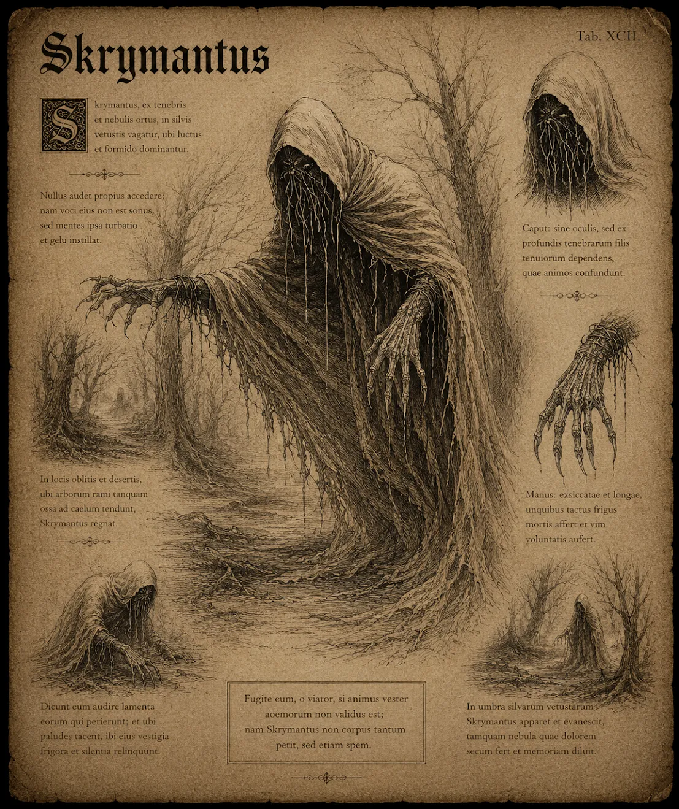

# Skrymant

{.spelledare}Skrymanter är starka fiender som söker villebråd på egen hand. En grupp äventyrare borde vara jämnstarka med en skrymant.{/}

Skrymanten är ett skräckinjagande väsen som rör sig genom mörkret som en skugga. Dess kropp är dold under en sliten, mörk kappa som fladdrar i vinden, och under den stora huvan skymtar endast två gula, glödande ögon. Där dess mun, näsa och haka borde vara, ser man istället intrasslade rötter som rör sig som levande ormar.

Monstrets händer, som sticker ut från kappans ärmar, har sex fingrar på varje hand, och i fingerspetsarna sitter långa, vassa naglar som liknar smala knivar. Dessa naglar kan skära igenom nästan allt, och en beröring från dem sägs kunna dra ut själen från en kropp.

Skrymanten är ett fruktat monster, inte bara på grund av sitt utseende utan också för sin förmåga att försvaga och dränera livskraften från sina offer. Dess närvaro fyller luften med en kvävande känsla av hopplöshet och kyla, och dess mål är att förgöra allt liv som kommer i dess väg.

# Attacker och förmågor

Antal attacker: 3/SR \
Undvika attack: 16

## Klösa

FV: 15 \
Skrymanten klöser offret med sina sylvassa naglar. \
Skada: 2T6+2

## Rotskri

Skrymanten avger ett kusligt skri som skär i öronen. Alla som hör skriet måste slå PSY-5, misslyckas slaget tar offret skada och blir paralyserad i en stridsrunda. \
Skada: 1T8+2 \
CD: 3 SR

## Själsdragning

Skrymanten suger livskraften ur sitt offer. Offret tar skada och skrymanten helas för samma mängd kroppspoäng i valfri kroppsdel. \
Skada: 1T6+6 \
CD: 1 SR

## Mörkerflöde (passiv)

Var Skrymanten än går flödar det ett mörker från dess kropp som kväver livskraften i allt det vidrör.

Varje stridsrunda tar alla spelare som befinner sig inom 10m radie av skrymanten 1T6 skada i slumpmässig kroppsdel. Skadan är magisk och ignorerar RV. {.spelledare}Denna skada kan blockeras av en magisk sköld.{/}

# Kroppsform och kroppspoäng

**Typ:** Fysisk, skräckvarelse

**Total kroppspoäng:** 125

| Resultat | Träffpunkt | RV | KP |
| --- | --- | --- | --- |
| 1-2 | Huvud | 4 | 31 |
| 3-4 | Höger arm | 4 | 31 |
| 5-6 | Vänster arm | 4 | 31 |
| 9-14 | Bröst | 4 | 62 |
| 14-16 | Mage | 4 | 41 |
| 17-20 | Rötter | 4 | 41 |

# Motstånd och svagheter

| Typ av attack | Effekt |
| --- | --- |
| Fysisk | 100% |
| Magisk | 50% |
| Helig | 200% |
