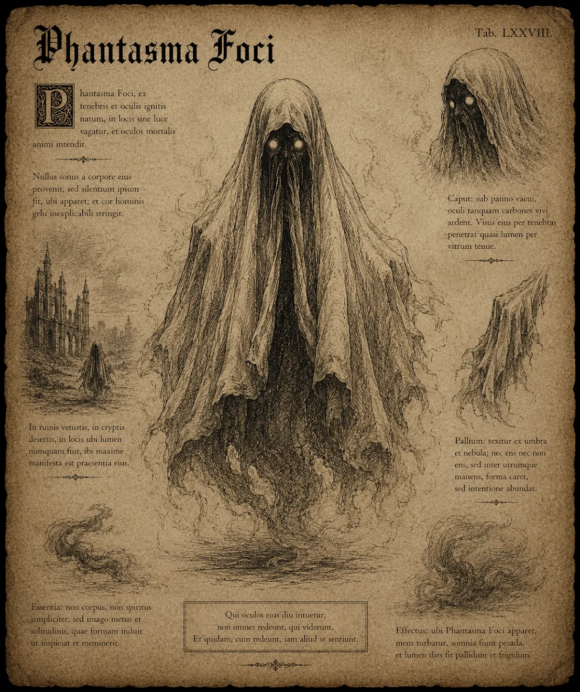

# Vålnaden i eldstaden

{.spelledare}En grupp äventyrare borde vara jämnstarka med vålnaden.{/}

Vålnaden framför er har en humanoid form och är ungefär lika stor som en vuxen människa. Den svävar ungefär en halvmeter ovanför marken och är insvept i ett ljust skynke som döljer dess exakta detaljer. Från under skynket sipprar skuggor och rök som verkar röra sig nästan som levande. Dess mest framträdande drag är de lysande orange ögonen som glöder i mörkret, vilket ger vålnaden ett kusligt och intensivt utseende.

# Attacker och förmågor

Antal attacker: 2/SR \
Undvika attack: -

## Skuggklor

FV: 16 \
Vålnaden förlänger sina händer till skarpa, mörka klor av rök och skugga som snabbt sveper mot fienderna, orsakar skada och dränerar livskraft. \
Skada: 1T6+8

## Dödsfrost

Vålnaden fryser marken under sig, vilket orsakar offer som står i närheten att frysa fast eller glida och tappa balansen. \
Alla närstridshandlingar inom 5 meter radie får -5. \
Skada: 2T6+2 (magisk is) \
CD: 1 SR

## Gravkalla Vindar

Vålnaden framkallar en iskall vind som blåser genom offren, vilket orsakar frostskada och tillfälligt saktar ner deras rörelser. \
Skada 1T8+4 \
CD: 1 SR

## Ektoplasmavåg

Vålnaden laddar upp energi och släpper ut en stark tryckvåg av ektoplasma som stöter tillbaka offer och orsakar skada. Alla offer inom 20 meters radie trycks bakom 5 meter. Offren måste klara ett SMI/2 slag för att inte falla omkull. Om offren faller omkull mister de sin nästa stridsrunda på att ställa sig upp. \
Skada: 1T10 \
CD: 2 SR

# Kroppsform och kroppspoäng

**Typ:** Icke-fysisk, skräckvarelse, odöd

**Total kroppspoäng:** 125

| Resultat | Träffpunkt | RV | KP |
| --- | --- | --- | --- |
| 1-2 | Huvud | - | 31 |
| 3-4 | Höger arm | - | 31 |
| 5-6 | Vänster arm | - | 31 |
| 7-11 | Bröst | - | 62 |
| 12-14 | Mage | - | 41 |
| 15-17 | Höger ben | - | 41 |
| 18-20 | Vänster ben | - | 41 |

Vålnaden är icke-fysisk och kan endast bli skadad av magi. Mest effektivt är heliga attacker.

# Motstånd och svagheter

| Typ av attack | Effekt |
| --- | --- |
| Fysisk | 0% |
| Magisk | 50% |
| Helig | 200% |
