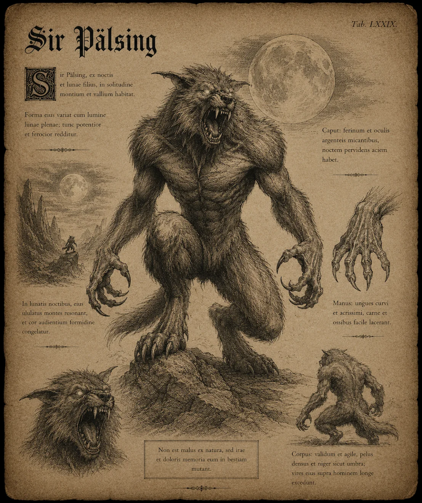

# Varulv: Sir Pälsing

{.spelledare}Sir Pälsing är Lord Viktor Voldarens livvakt. Pälsing är tvingad av stark magi att försvara Viktor med sitt liv. Viktor har föraktfullt adlat Pälsing som ett skämt. Det var även Viktor som valde namnet. Viktor är dessutom ansvarig för att ha förvandlat sir Pälsing till varulv - i sitt tidigare liv var han en av Viktors fiender.{/}

Varulven är över två meter hög med en massiv, muskulös kropp täckt av mörk, sträv päls. Dess kropp är knotig och kraftfull, med breda axlar och starka, seniga armar som slutar i klor så långa och vassa att de kan riva igenom metall. Pälsen är mörkgrå och nästan svart, och dess ögon glöder i ett hotfullt gult sken. Varulvens käkar är överdimensionerade, med skarpa tänder som gnistrar när de blottas i ett vrålande grin.

Ansiktet är en fruktansvärd blandning av människa och varg, med långa, spetsiga öron och en nos som rycker av ilska. Saliv droppar från dess käftar, och dess andetag är grovt och väsande, som om den hela tiden håller tillbaka en våg av destruktiv kraft.

Viktor har namngivit sin varulv *Pälsing*, ett namn som både är kort och förnedrande, som om varelse bara var ett djuriskt redskap snarare än en varelse av enorm kraft. Namnet påminner om ett husdjur, men det är tydligt att Pälsing är en dödlig fiende som Viktor håller i ett järngrepp med sin magi.

# Attacker och förmågor

Antal attacker: 2/SR \
Undvika attack: 16

## Riva

FV: 14 \
Pälsing river sitt offer med sina mäktiga klor. Klorna är så vassa så de ignorerar fysisk RV. \
Skada: 2T6+2

## Bita

FV: 15 \
Pälsing biter sitt offer med sina kraftiga käkar. \
Skada: 3T8 \
CD: 1 SR

## Bita tag

FV: 13 \
Pälsing biter tag i sitt offers strupe och håller fast. Pälsing låser käftar och håller fast tills antingen han eller offret dör, eller om offret lyckas bryta sig loss (eller om Viktor beordrar Pälsing att släppa). \
Varje stridsrunda kan offret försöka bryta sig loss. Offret måste klara ett STY-20 slag för att lyckas bryta sig loss. Andra kan hjälpa offret att komma loss - de slår då STY-15. \
Skada: 8/SR

# Kroppsform och kroppspoäng

**Typ:** Fysisk, monster

**Total kroppspoäng:** 250

| Resultat | Träffpunkt | RV | KP |
| --- | --- | --- | --- |
| 1-2 | Huvud | 12 | 83 |
| 3-4 | Höger arm | 12 | 83 |
| 5-6 | Vänster arm | 12 | 83 |
| 7-11 | Bröst | 12 | 125 |
| 12-14 | Mage | 12 | 62 |
| 15-17 | Höger ben | 12 | 62 |
| 18-20 | Vänster ben | 12 | 62 |

# Motstånd och svagheter

| Typ av attack | Effekt |
| --- | --- |
| Fysisk | 75% |
| Magisk | 125% |
| Helig | 150% |

{.spelledare}
# Uppdrag

## Kurera lykantropi

Pälsing vet inte om detta uppdrag.

Spelarna kan kurera Pälsings lykantropi och förvandla honom tillbaka till människa. Pälsing kommer då att vända sig mot Viktor och hjälpa spelarna att döda honom.

Spelarna behöver köpa en **magisk dryck** som finns på [Den eviga auktionen i Spökbasaren, Köpmansplatsen](https://docs.google.com/document/u/0/d/1zbc7jSCcqWLIlbU94CtiUQdEJuw5gbZ5GYqJUfRhCRE/edit), och tvinga Sir Pälsing att dricka drycken.
{/}
